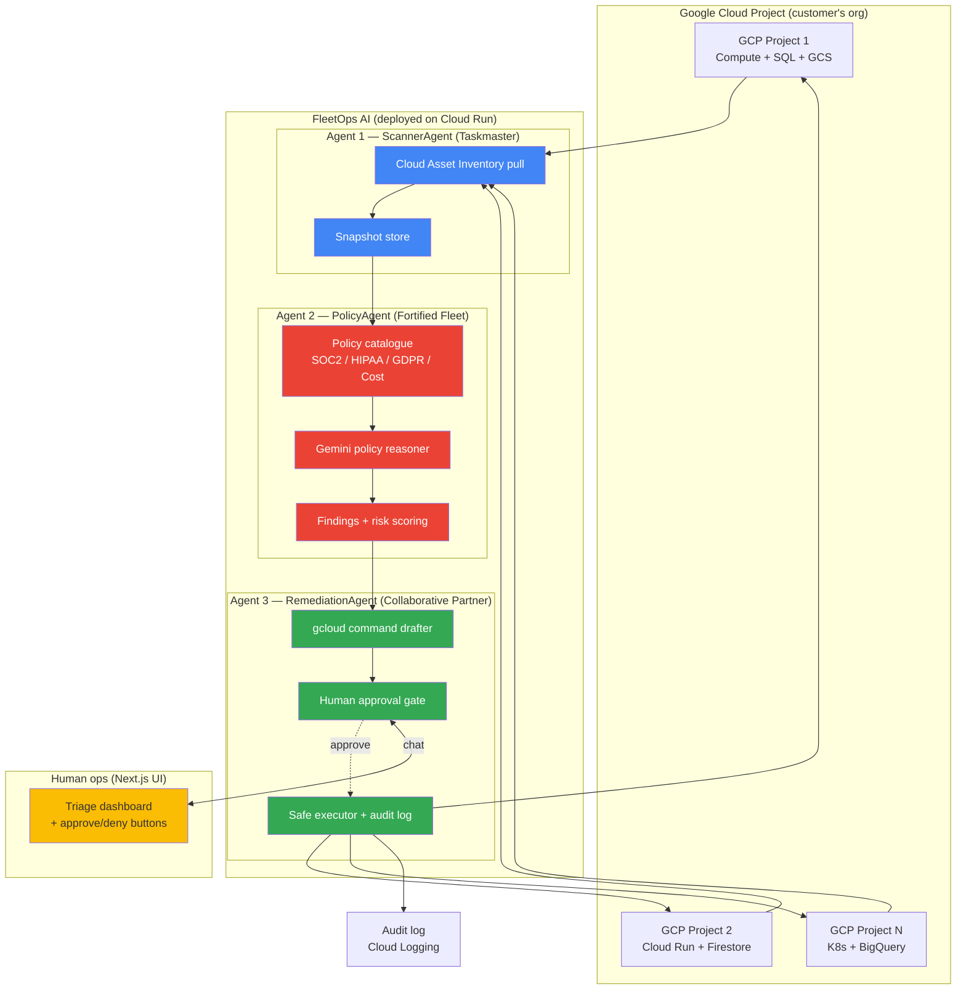

# FleetOps AI — Concept, Architecture, Schedule

**Hackathon**: All Things Agentic (Google Cloud) — Aug 3–31, 2026
**Track**: The Fortified Enterprise Fleet (primary) — with Taskmaster + Collaborative Partner as stacking secondaries
**Prize target**: $10,000 USD cash (1st place, Fortified Enterprise Fleet)

---

## The concept

**FleetOps AI** is a 3-agent Google ADK fleet that acts as a **24/7 autonomous FinOps + Security compliance officer for Google Cloud projects.**

**The problem it solves.** A mid-size org running 20+ GCP projects is bleeding money on stale resources (idle Cloud SQL, oversized Compute Engine, orphaned load balancers) AND accumulating security drift (public buckets, overly permissive IAM, missing encryption). Manual auditing takes a small SRE team hours per week and still misses drift. A one-shot LLM prompt can't do this — you need a **fleet** of specialised agents that runs asynchronously, reasons about policy, and coordinates with a human ops engineer for consequential fixes.

**The value proposition.** Point FleetOps AI at your GCP org. Overnight, it inventories every project, evaluates every resource against your compliance policy catalogue (SOC2 / HIPAA / GDPR / cost thresholds), and by morning delivers a **prioritized remediation queue** with pre-drafted `gcloud` commands. You (the human) tap ✅ on the fixes you approve. It executes them safely and logs an audit trail. What used to be a 10-hour weekly SRE sweep becomes a 15-minute morning triage.

**Why 3 agents (not 1 monolithic prompt)?**
- Different agents specialise in different judgement calls: inventory (Cloud Asset APIs — no LLM needed), policy reasoning (Gemini reads NL policies), remediation planning (Gemini + tool-use for `gcloud`).
- Each agent runs on its own cadence: Scanner runs continuously in background (Taskmaster), Policy runs on each new snapshot, Remediation waits for human input (Collaborative Partner).
- Isolation = safety: RemediationAgent is the ONLY agent with `gcloud` write scope; ScannerAgent + PolicyAgent are read-only. Enterprise auditor-grade separation of concerns (Fortified Enterprise Fleet track).

## Track stacking

The single build hits ALL 3 tracks. Pick submission-track based on strategic fit (Fortified Enterprise Fleet = least crowded):

| Track | Fit |
|-------|-----|
| **The Fortified Enterprise Fleet** (submit here) | Multi-agent, RBAC-separated, audit-logged, enterprise policy-driven. ✅ Primary. |
| **The Taskmaster** | ScannerAgent runs asynchronously in the background over massive resource inventories. ✅ Strong secondary. |
| **The Collaborative Partner** | RemediationAgent pairs with the human ops engineer via chat UI, waits for approval before executing. ✅ Strong tertiary. |

## Architecture



## Google ADK agent shape (target)

Each agent is a `google.adk.Agent` instance with declared tools:

```python
from google.adk import Agent
from google.adk.tools import Tool

scanner = Agent(
    name="ScannerAgent",
    model="gemini-2.0-flash-exp",
    tools=[list_gcp_projects, snapshot_assets, store_snapshot],
    instructions="Continuously inventory GCP assets across all projects...",
)

policy = Agent(
    name="PolicyAgent",
    model="gemini-2.0-flash-exp",
    tools=[load_policy_catalogue, evaluate_asset, score_risk],
    instructions="For each asset, evaluate against policy catalogue...",
)

remediation = Agent(
    name="RemediationAgent",
    model="gemini-2.0-flash-exp",
    tools=[draft_gcloud_command, request_human_approval, execute_command, write_audit_log],
    instructions="For each finding, draft a remediation, request human approval, execute if approved...",
)
```

In MOCK MODE (`FLEETOPS_MOCK=true`, the default for this MVP), the agents are simulated with deterministic Python + a bundled realistic dataset — no API keys required, runs offline, tests fully cover the pipeline.

## Demo dataset (mock mode)

Bundled snapshot of a fictional "AcmeCorp" GCP org:
- **3 projects** (`acme-prod`, `acme-staging`, `acme-analytics`).
- **17 resources** (Compute Engine VMs, Cloud SQL instances, GCS buckets, Cloud Run services, IAM policies, load balancers).
- **8 realistic findings**:
  1. GCS bucket `acme-user-uploads` is **publicly readable** → HIPAA/GDPR violation, critical.
  2. Cloud SQL `acme-prod-db-01` runs `db-n1-highmem-96` at 4% CPU — **oversized**, ~$4,800/mo waste.
  3. IAM: `staging-deployer@acme.iam.gserviceaccount.com` has `Owner` on prod → **overly permissive**, SOC2 CC6.1 violation.
  4. Compute VM `orphan-worker-01` has been idle 42 days, no attached workload → ~$180/mo waste.
  5. Load balancer `acme-lb-legacy` has 0 healthy backends for 14 days → drift, cost.
  6. Cloud SQL `acme-prod-db-01` has no automated backup schedule → SOC2 A1.2 violation.
  7. GCS bucket `acme-medical-records` missing CMEK encryption → HIPAA violation.
  8. Firewall rule `default-allow-ssh` allows `0.0.0.0/0` on port 22 → CIS Benchmark 3.6.

Each finding has a pre-drafted `gcloud` remediation command that RemediationAgent presents to the human.

## MVP scope for hackathon submission

**In scope (MVP delivered here):**
- Next.js 14 + TypeScript + Tailwind frontend (single-page triage dashboard).
- Python-shaped ADK agent orchestration in TypeScript (mock mode) — bundled Cloud Asset Inventory snapshot, policy catalogue, remediation drafts.
- 3 agents simulated with deterministic logic + mock LLM responses.
- Live-mode wiring for `GOOGLE_AI_API_KEY` → real Gemini calls (single env-var flip).
- Human approval gate: approve/deny per finding, execute-mock, audit log.
- End-to-end test suite (Vitest).
- Full mock mode default (`FLEETOPS_MOCK=true`) — runs with zero keys.

**Deferred to post-MVP (documented but not built):**
- Real Cloud Asset Inventory API integration (requires GCP service-account JSON at test time).
- Real `gcloud` command execution (dangerous without human review of every call).
- Cloud Run deployment (SETUP.md includes exact deploy steps for Jerom).
- Persistence beyond in-memory (Firestore migration deferred).

## Schedule (Jerom's registration → submission)

| Date | Owner | Task |
|------|-------|------|
| Aug 18 (today) | Claude | ✅ MVP built into `incubator/all-things-agentic` |
| Aug 19 | Jerom | Register at [allthingsagentichackathon.devpost.com](https://allthingsagentichackathon.devpost.com/) (see SETUP.md Claude in Chrome runbook) |
| Aug 19 | Jerom | Claim $150 GCP credits via Devpost Resources tab |
| Aug 20 | Jerom | Get `GOOGLE_AI_API_KEY` at [aistudio.google.com/app/apikey](https://aistudio.google.com/app/apikey) (free tier) |
| Aug 22–24 | Jerom (weekend) | (Optional) Wire real GCP Cloud Asset Inventory service-account for the demo project; deploy MVP to Cloud Run |
| Aug 25 | Jerom | Record ≤4-min demo video (mock mode is fine; screen-capture at least one Cloud Console tab visible for deployment proof) |
| Aug 26 | Jerom | Promote to standalone repo `jeromtom/fleetops-ai` (public) |
| Aug 28 (2-day buffer) | Jerom | Submit at [allthingsagentichackathon.devpost.com/submit](https://allthingsagentichackathon.devpost.com/) — Track: **The Fortified Enterprise Fleet** |
| Aug 31 5PM PT | HARD DEADLINE | Submission close |

**Critical path**: Demo video is the highest-weighted judging item ("Proof of Action" — unedited live execution). Record it AFTER Cloud Run deploy so the Cloud Run URL is visible.
