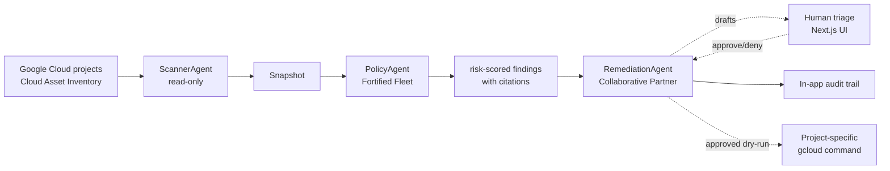

# FleetOps AI

**Three-stage GCP FinOps + security + compliance workflow with live Cloud Asset Inventory.**
Built for the [All Things Agentic Hackathon](https://allthingsagentichackathon.devpost.com/) · Track: **The Fortified Enterprise Fleet** · Prize target: **$10,000 USD** · Deadline: **Aug 31, 2026 5PM PT**.

---

## What it does

Point FleetOps AI at your Google Cloud org. Overnight, it:

1. **ScannerAgent** — reads real resource and IAM data through Google Cloud Asset Inventory using Application Default Credentials.
2. **PolicyAgent** — evaluates normalized assets against a deterministic, version-controlled catalogue covering SOC2, HIPAA, GDPR, CIS, and cost signals.
3. **RemediationAgent** — drafts a project-specific `gcloud` fix, waits for a human decision, and records an audit event. Approval is deliberately **dry-run only** in this build.

Result: a 10-hour weekly SRE audit sweep becomes a 15-minute morning triage.

## Architecture



Full architecture + track-stacking rationale in [`PLAN.md`](./PLAN.md).

## Quick start (mock mode — zero keys, offline)

```bash
npm install
npm run dev
# → http://localhost:3000, then click "Run new scan"
```

Mock mode uses a bundled AcmeCorp GCP snapshot (17 resources, 9 findings, 9 drafted `gcloud` remediations). No API keys required.

## Live sample project

The public deployment is **not using the bundled snapshot**. It scans a real, billed
GCP sandbox through Cloud Asset Inventory and is currently configured with four tagged,
low-cost fixtures:

| Real asset | Intentional finding | Safety property |
|---|---|---|
| Public GCS bucket with one harmless text object | Anonymous object read | Contains no private data |
| GCS bucket named `medical-records` without CMEK | Sensitive-name encryption policy | Empty bucket |
| `tcp:22` firewall rule from `0.0.0.0/0` | CIS network exposure | Targets a tag used by no VM |
| `staging-deployer` service account with Editor | Cross-environment broad IAM | Keyless service account |

Run `POST /api/scan` at <https://fleetops.rexindynamics.com> to see `source:
"cloud-asset"`, four resources, four findings, and four drafts. The fixture setup and
cleanup scripts are in [`demo-project/`](./demo-project/).

## Tests

```bash
npm test    # 32 tests across scanner / live inventory / policy / remediation / fleet
```

## Deploy to Google Cloud Run

**Live demo:** <https://fleetops.rexindynamics.com>

**Cloud Run origin:** <https://fleetops-ai-ywb5cstj7a-uc.a.run.app>

```bash
./deploy.sh YOUR_GCP_PROJECT_ID          # builds the Dockerfile, deploys, prints the service URL
```

Or run the same container locally first:

```bash
docker build -t fleetops-ai .
docker run -p 8080:8080 fleetops-ai      # → http://localhost:8080
```

Live Cloud Asset Inventory mode and all environment variables are documented in
[`SETUP.md`](./SETUP.md).

The branded endpoint is a minimal streaming Cloudflare Worker proxy. Its source,
configuration, and verification commands are in
[`cloudflare-proxy/`](./cloudflare-proxy/); the application and remediation
safety controls remain on Cloud Run.

## Hackathon submission checklist

See [`DEMO_SCRIPT.md`](./DEMO_SCRIPT.md) for the ≤4-min demo video walkthrough and the Devpost long-description text.

## License

MIT — see [`LICENSE`](./LICENSE).
