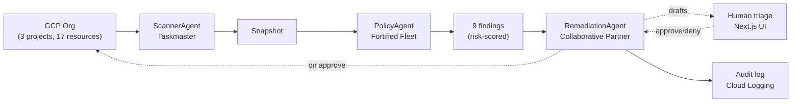

# FleetOps AI

**3-agent Google ADK fleet for GCP FinOps + Security + Compliance.**
Built for the [All Things Agentic Hackathon](https://allthingsagentichackathon.devpost.com/) · Track: **The Fortified Enterprise Fleet** · Prize target: **$10,000 USD** · Deadline: **Aug 31, 2026 5PM PT**.

---

## What it does

Point FleetOps AI at your Google Cloud org. Overnight, it:

1. **ScannerAgent** (Taskmaster) — asynchronously inventories every resource across every project via Cloud Asset Inventory. Read-only scope.
2. **PolicyAgent** (Fortified Enterprise Fleet) — evaluates every asset against a policy catalogue (SOC2, HIPAA, GDPR, CIS, cost thresholds). Uses Gemini 2.0 Flash to reason about NL policies. Read-only scope.
3. **RemediationAgent** (Collaborative Partner) — drafts a `gcloud` fix for each finding, waits for your ✅ tap, executes only after approval, writes an audit log to Cloud Logging. **Sole write-scoped agent.**

Result: a 10-hour weekly SRE audit sweep becomes a 15-minute morning triage.

## Architecture



Full architecture + track-stacking rationale in [`PLAN.md`](./PLAN.md).

## Quick start (mock mode — zero keys, offline)

```bash
npm install
npm run dev
# → http://localhost:3000, then click "Run new scan"
```

Mock mode uses a bundled AcmeCorp GCP snapshot (17 resources, 9 findings, 9 drafted `gcloud` remediations). No API keys required.

## Tests

```bash
npm test    # 30 tests across scanner / policy / remediation / fleet — all passing
```

## Deploy to Google Cloud Run

```bash
./deploy.sh YOUR_GCP_PROJECT_ID          # builds the Dockerfile, deploys, prints the service URL
```

Or run the same container locally first:

```bash
docker build -t fleetops-ai .
docker run -p 8080:8080 fleetops-ai      # → http://localhost:8080
```

Live mode (real Gemini + real Cloud Asset Inventory scan) and all environment
variables are documented in [`SETUP.md`](./SETUP.md).

## Hackathon submission checklist

See [`DEMO_SCRIPT.md`](./DEMO_SCRIPT.md) for the ≤4-min demo video walkthrough and the Devpost long-description text.

## License

MIT — see [`LICENSE`](./LICENSE).
